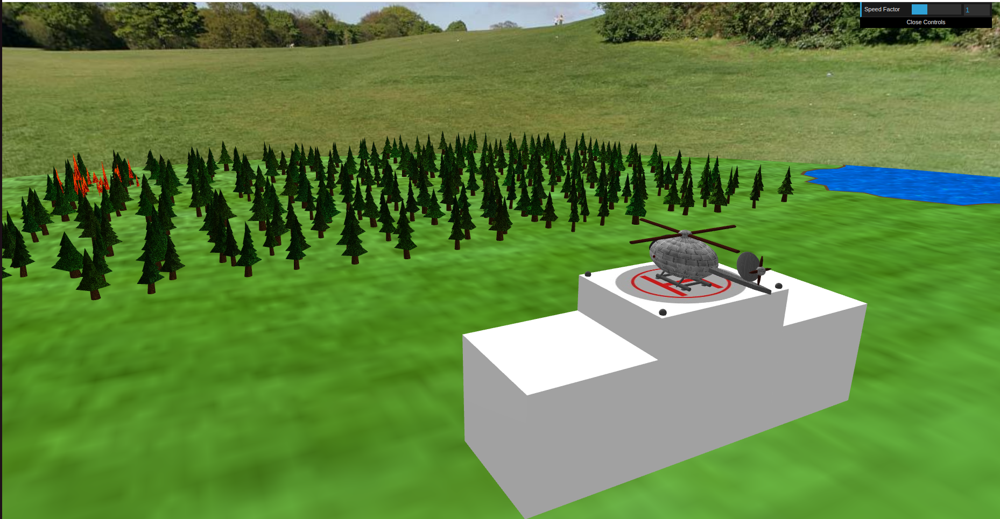

# CG 2024/2025

## Group T12G09
| Name             | Number    | E-Mail             |
| ---------------- | --------- | ------------------ |
| Leonardo Teixeira | 202208726 | up202208726@up.pt |
| Tiago Pinto | 202206280 | up202206280@up.pt |

## Project - Helicopter Simulation

This project implements a 3D helicopter simulation using WebGL and the CGF framework. The helicopter can navigate through a 3D environment, collect water from a lake, and drop it on fires to extinguish them.

### Key Features
- Interactive helicopter control with realistic physics
- Water collection and fire extinguishing mechanics
- 3D terrain with lakes, forests, and buildings
- Dynamic lighting and texturing
- Custom geometric primitives (oblique cones, irregular polygons)
- Shader effects for flames and heliport animations

For the complete implementation, see the [project code](proj/).

----

### Course Assignments
  - [tp1](tp1/README.md)
  - [tp2](tp2/README.md)
  - [tp3](tp3/README.md)
  - [tp4](tp4/README.md)
  - [tp5](tp5/README.md)
