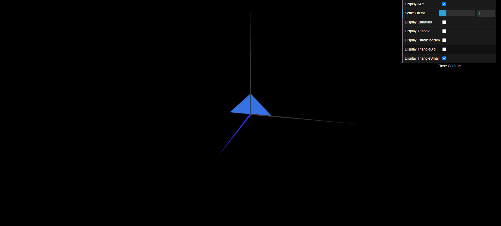
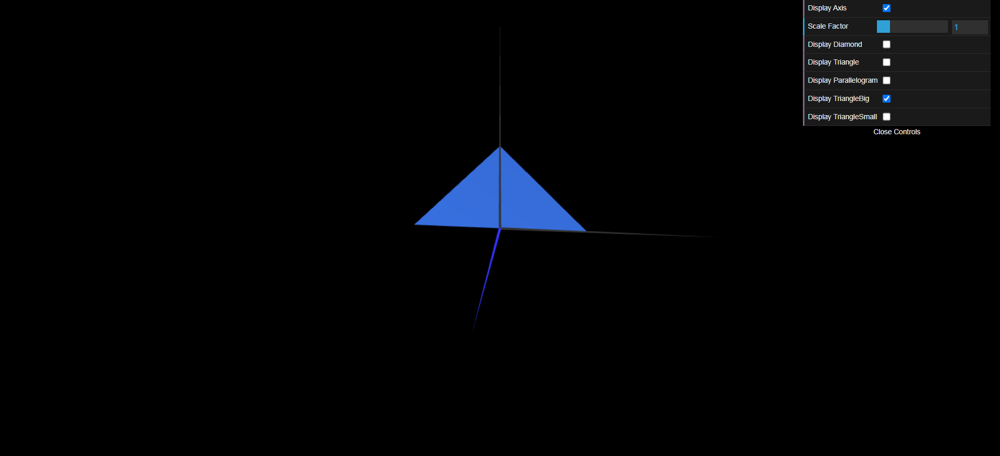

# CG 2024/2025

## Group T12G09

## TP 1 Notes

- Exercício 1:
Neste exercício, criei as classes MyTriangle e MyParallelogram, definindo os seus vértices e índices. Adicionei ainda checkboxes na interface para controlar a visibilidade de cada objeto (losango, triângulo e paralelogramo). O paralelogramo é visível dos dois lados.

- Exercício 2:
Implementei as classes MyTriangleSmall e MyTriangleBig, com vértices e índices ajustados para os tamanhos específicos de cada triângulo. Ambos foram configurados para serem exibidos correctamente na cena.

