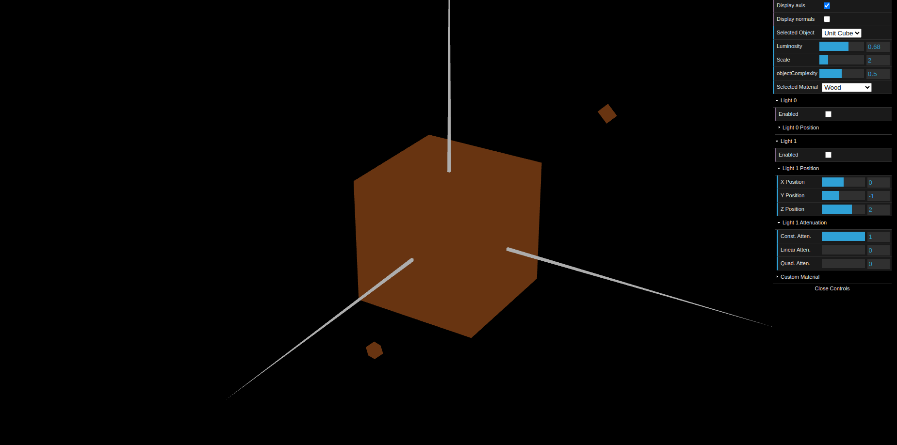
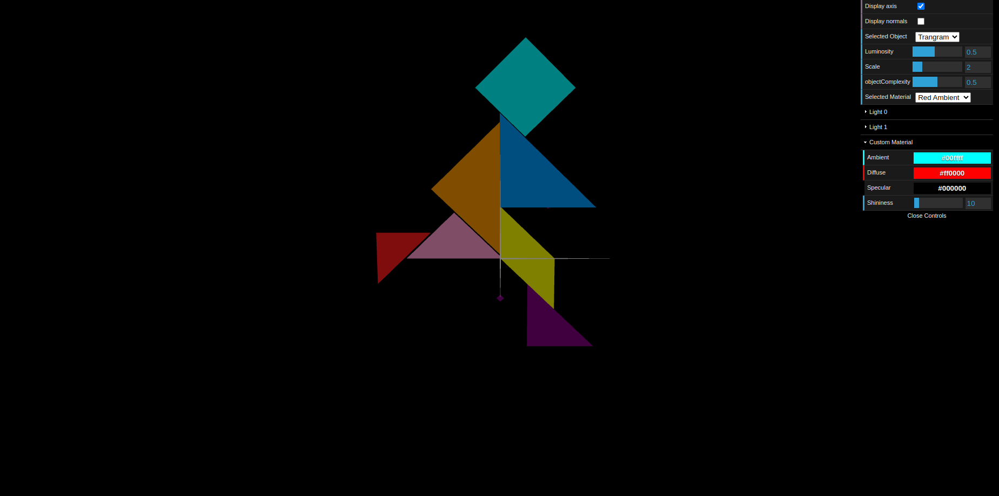
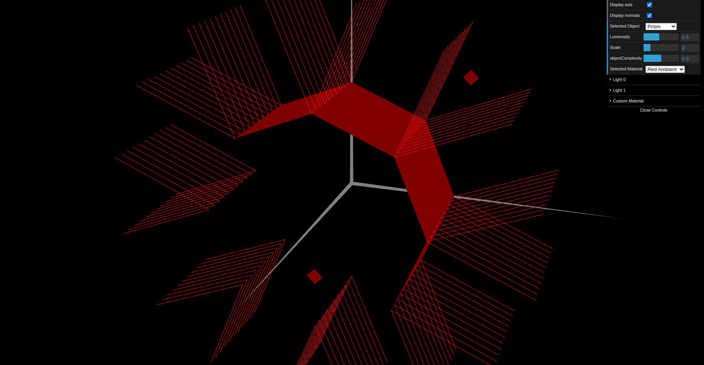
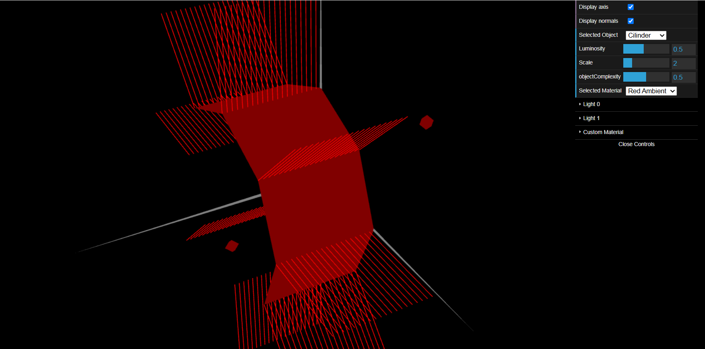

# CG 2024/2025

## Group T12G09

## TP 3 Notes

- Exercício 1:
Neste exercício, adicionamos os objetos MyTangram e MyUnitCube à cena, definimos normais e aplicamos materiais.

- Exercício 2:
Neste exercício, implementamos a classe MyPrism para desenhar um prisma com um número variável de lados e andares, ajustando as normais.

- Exercício 3:
Neste exercício, criamos a classe MyCylinder a partir do prisma e ajustamos as normais para suavizar a iluminação.

