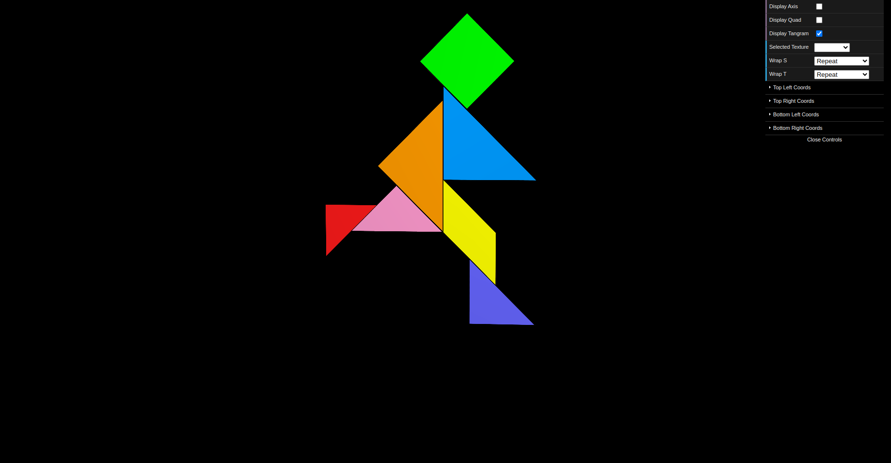
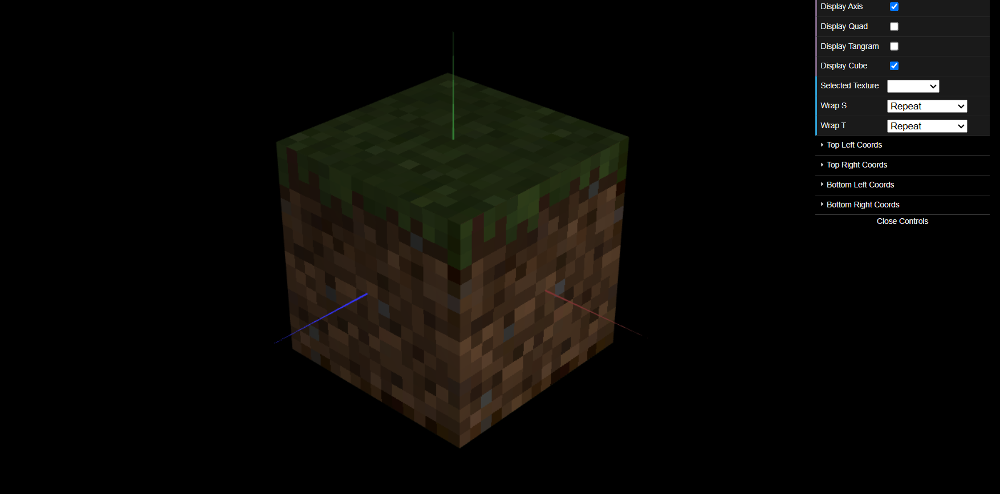

# CG 2024/2025

## Group T12G09

## TP 4 Notes

- Exercício 1:
Neste exercício, adicionamos texturas ao Tangram, ajustando as coordenadas de textura de cada peça para alinhar com a imagem tangram.png.
- Exercício 2:
Neste exercício, modificamos a classe MyUnitCubeQuad para aceitar seis texturas opcionais e aplicamos filtragem bilinear para melhorar a qualidade das texturas.

