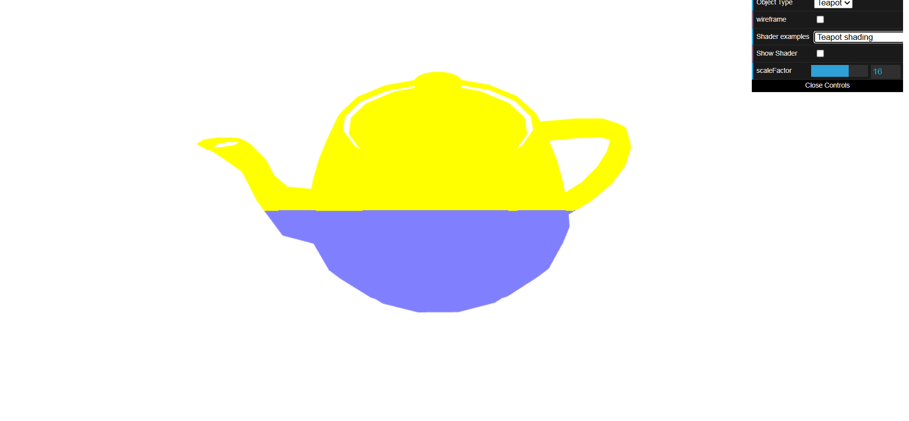
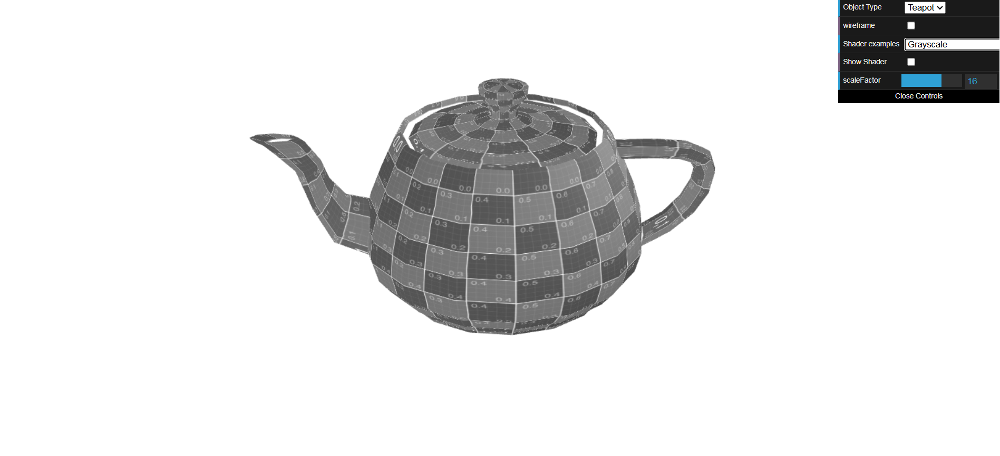
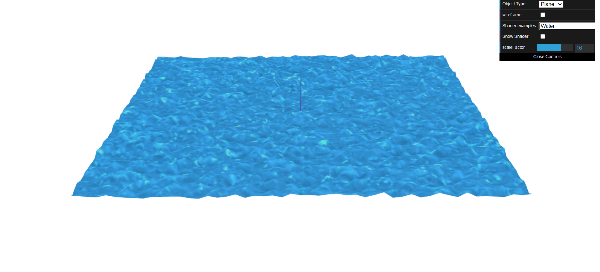

# CG 2024/2025

## Group T12G09

## TP 5 Notes

- Exercício 1:
Criamos shaders para colorir o bule conforme a posição na janela, alternando entre amarelo e azul.

- Exercício 2:
Implementamos shaders para simular um efeito de água em um plano, utilizando mapas de altura e animação das coordenadas de textura ao longo do tempo.

